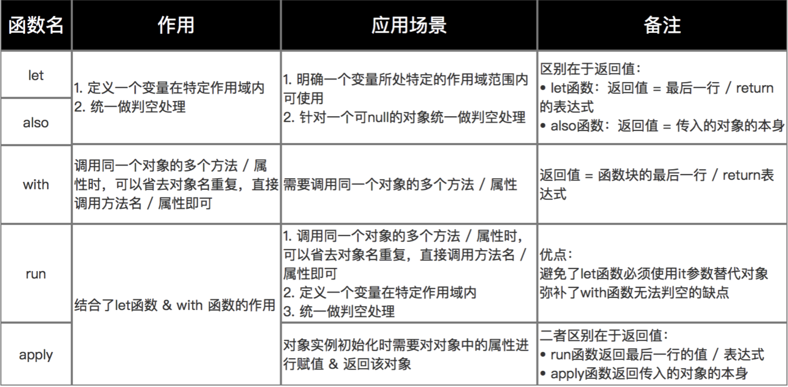

# kotlin-grammar

## kotlin中快速引用布局
  首先引入maven包：
  ```
  implementation group: 'org.jetbrains.kotlin', name: 'kotlin-android-extensions-runtime', version: '1.4.32'
  ```
  然后在plugins中启用kotlin-android-extensions:
  ```
  id 'kotlin-android-extensions'
  ```
  ***
  
## kotlin中内置函数let、also、with、run、apply
  Kotlin中有一些便于开发者编码的内置函数，能大大提高开发者的开发效率，下面我们来分开介绍。
  * let
     * 函数定义
        它是一个作用域函数
     * 函数作用
        1. 可以在一个特定的作用域内定义变量
        2. 避免写一些重复的判空语句
     * 应用场景
        1. 在一个特定作用域内统一使用变量，如统一判空处理
     * 函数返回值
        let函数的返回值为：函数显示return的值，如果函数未显示return，则为函数最后一行表达式的值
     * 示例
     ```
     // 作用1：使用it替代object对象去访问其公有的属性 & 方法
     // 作用域内的it即代表object
     object.let{
       it.todo()
     }
    // 作用2：判断object为null的操作
    object?.let{//表示object不为null的条件下，才会去执行let函数体
      it.todo()
    }
    ```
  
  * also
    * also函数与let函数大部分都一样，唯一不同的是它们的返回值不同；
      also函数的返回值是传入的对象本身
    * 示例
    ```
    // let函数
    var result = mVar.let {
               it.function1()
               it.function2()
               it.function3()
               999
    }
    // 最终结果 = 返回999给变量result

    // also函数
    var result = mVar.also {
               it.function1()
               it.function2()
               it.function3()
               999
    }
    // 最终结果 = 返回一个mVar对象给变量result
    ```

  * with
    * 函数定义
      当我们需要调用同一个对象的多个方法/属性时，我们可以在代码块中省略对象名，而直接调用方法/属性名即可
    * 应用场景
      需要调用同一个对象的多个方法/属性
    * 函数返回值
      函数的最后一行/return
    * 使用方式
      ```
      with(object) {
        function1()
        function2()
        function3()
      }
      ```
    * 示例
    ```
    // 此处要调用people的name 和 age属性
    // kotlin
    val people = People("carson", 25)
    with(people) {
      println("my name is $name, I am $age years old")
    }

    // Java
    User peole = new People("carson", 25);
    String var1 = "my name is " + peole.name + ", I am " + peole.age + " years old";
    System.out.println(var1);
    ```

  * run
    * 函数定义
      该函数是let函数和with函数的结合
    * 应用场景
      1. 调用同一个对象的多个方法/属性时，可以省去对象名重复，直接调用方法名/属性即可
      2. 定义一个变量在特定作用域内
      3. 统一做判空处理
    * 函数返回值
      函数块的最后一行/return表达式
    * 示例
    ```
    // 此处要调用people的name 和 age属性，且要判空
    // kotlin
    val people = People("carson", 25)
    people?.run{
        println("my name is $name, I am $age years old")
    }

    // Java
    User peole = new People("carson", 25);
    String var1 = "my name is " + peole.name + ", I am " + peole.age + " years old";
    System.out.println(var1);
    ```

  * apply
    * 函数定义
      apply函数与run函数功能类似，唯一不同的是两个函数的返回值不同：
      run函数的是函数的最后一行语句/return语句
      apply函数的返回值是传入的对象本身
    * 示例
    ```
    // run函数
    val people = People("carson", 25)
    val result = people?.run{
        println("my name is $name, I am $age years old")
        999
    }
    // 最终结果 = 返回999给变量result

    // apply函数
    val people = People("carson", 25)
    val result = people?.apply{
        println("my name is $name, I am $age years old")
        999
    }
    // 最终结果 = 返回一个people对象给变量result
    ```

## let、also、with、run、apply语法比较
  
